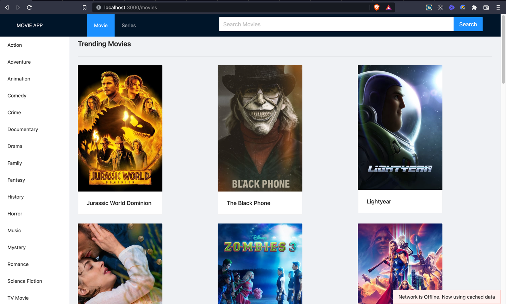
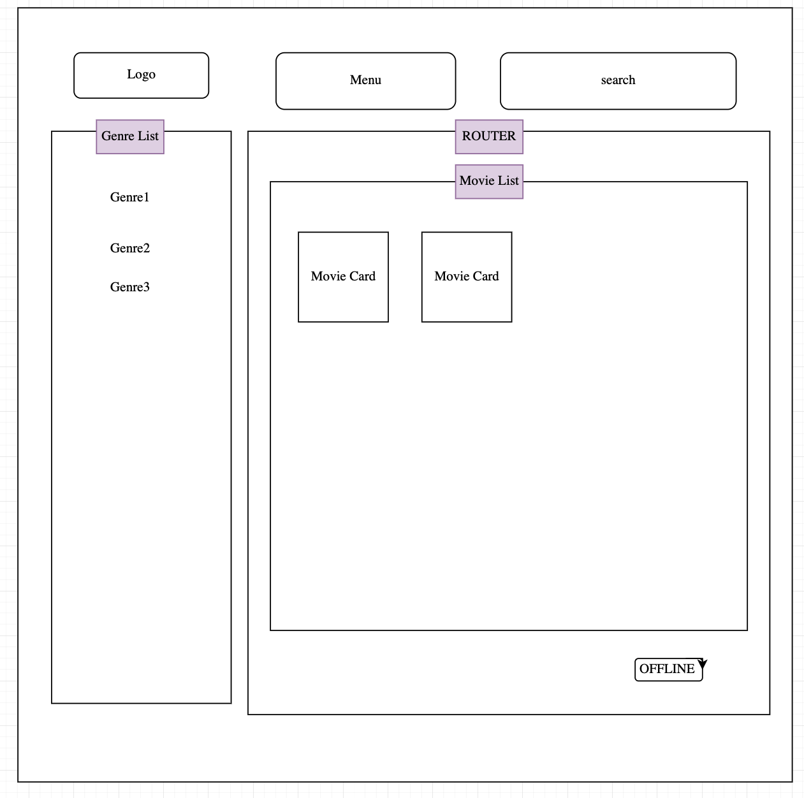
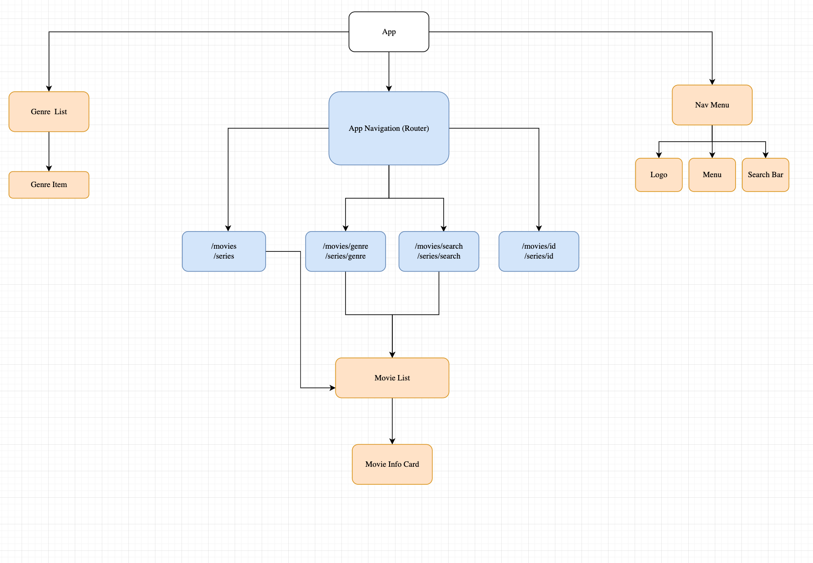

<div align="center">
   
</div>

<h3 align="center">Movie App</h3>

  <p align="center">
    <a href="https://movie-app-toybz.vercel.app/"><strong>View Demo »</strong></a>
 </p>

<!-- TABLE OF CONTENTS -->
<details>
  <summary>Table of Contents</summary>
  <ol>
 <li><a href="#about-the-project">About</a></li>
 <li><a href="#built-with">Built with</a></li>
 <li><a href="#getting-started">Getting started</a></li>
    <li><a href="#code-strcuture">Code structure</a></li>
<li><a href="#code-architecture">Code Architecture</a></li>
    <li><a href="#routes">Routes</a></li>
    <li><a href="#offline-feature">Offline and Cache Management</a></li>
    <li><a href="#notes-on-design-decisions">Design Decisions</a></li>
    <li><a href="#testing">Testing</a></li>
<li><a href="#other-things-that-I-didn't-work-on-but-took-notes of">Notes</a></li>

  </ol>
</details>


## About The Project

A web app that displays all the trending Movies and Series using the [TMDB](https://developers.themoviedb.org/) API. Users can  select series and movies based on their preferred genre as well as get extra details about the specific series or movie by selecting it.  Users can search for movies and series. Users can search by the movie name or series name and they will get to see all the results related to that particular name.


### Built With

* NextJS 
* React 
* Antd (React UI Components)
* Next-pwa 
* Typescript


## Getting Started

To run the code locally. Please clone the repo then install the dependencies using

```bash
yarn
```

then run the code below, to start the dev server

```bash
yarn dev
```

### Code Structure

```
├── api - contains the helper functions to fetch remote data
├── components - contains the components 
├── hooks - contains the hooks 
├── pages - contains the page codes, using NextJS structure.The route and page are explained in the Route section.              
├── public - contains static assets and service worker config files
├── types - contains the typescript types
├── utils - contains helper functions
├── .env - contains the environment variables
```


### Code Architecture
The app basically consist of 3 sections as set in the _app.tsx file.
The top nav menu, the sidebar with the genre list and the main content of the page (controlled by the router) 

Please see the images below for a visual representation.
<div align="center">
 

   
  
</div>


### Routes

| Route                          | Page File                             | Description                           |
|:-------------------------------|:--------------------------------------|:--------------------------------------|
| /                              |                                       | Redirects to /movies                  |
| /movies                        | pages/[mediaType]/index.tsx           | Shows the Trending movies             |
| /series                        | pages/[mediaType]/index.tsx           | Shows the Trending series             |
| /movies/genre/{id}?name={name} | pages/[mediaType]/genre/[genreId].tsx | Shows the movies in a genre           |
| /series/genre/{id}?name={name} | pages/[mediaType]/genre/[genreId].tsx | Shows the series in a genre           |
| /movies/{id}                   | pages/[mediaType]/[movieId].tsx       | Shows details of a movie              |
| /series/{id}                   | pages/[mediaType]/[movieId].tsx       | Shows details of a series             |
| /movies/search?query={query}   | pages/[mediaType]/search.tsx          | Shows the search results for a movie  |
| /series/search?query={query}   | pages/[mediaType]/search.tsx          | Shows the search results for a series |

```
Using [mediaType] dynamic param, we can have the code for movies and series in a file as shown above. The code uses the value of the mediaType to decide the media type (movies/series)  to fetch. 

This approach is efficient over having a separate folder structure for /movies and /series
```


## Offline feature

### Offline Alert
The app has a useOfflineStatus hook that listens to offline status of the device. If the device is offline, the No Internet Alert will be displayed. The alert is at the bottom of the pages/_app.tsx file

### Service Worker
The App uses service worker to cache the static assets and fetched routes. Once a resource is  cached the service worker returns the cached data even if there is no network. 
It paths that have not been cached, it will default to the pages/_offline.tsx file.
Using this approach, the app will be responsive when device is offline.

### Notes on Design Decisions

* I didn't use a global store because most the pages do not share data between each other and  because of the small scale of the app. In a large scale application that has lots of shared state, I would have used a global state management library like Redux Toolkit.

* To manage the SSR rendered pages returns  serverErrorOccurred and 
  serverErrorMessage prop when a fetch error occurs on the server, so we can show a custom error message on the client.

* I pushed the .env file to the remote repo, so you dont have to recreate it when testing locally. In an ideal real app scenario I wouldn't have pushed it to the remote repo.

### Testing
I used cypress to perform basics e2e test on the app.
The spec is located at cypress/e2e/app.cy.ts

#### Other things that I didn't work on but took notes of:
  * Pagination
  * The Cumulative Layout Shift on initial load
  * Mobile responsiveness
  * Styling and alignments
  * A loader when an operation (e.g request) is processing

 
